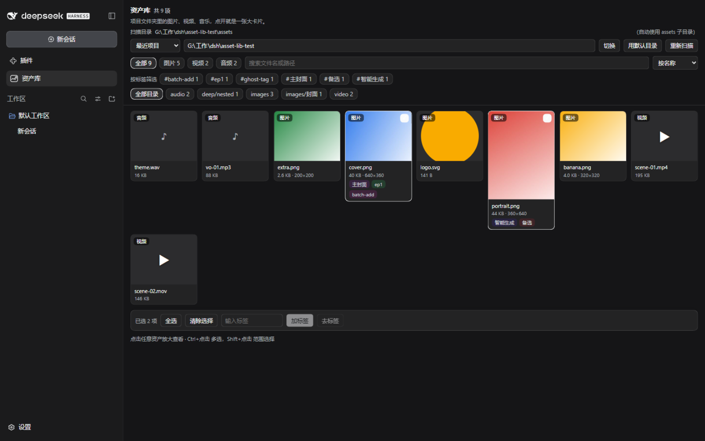
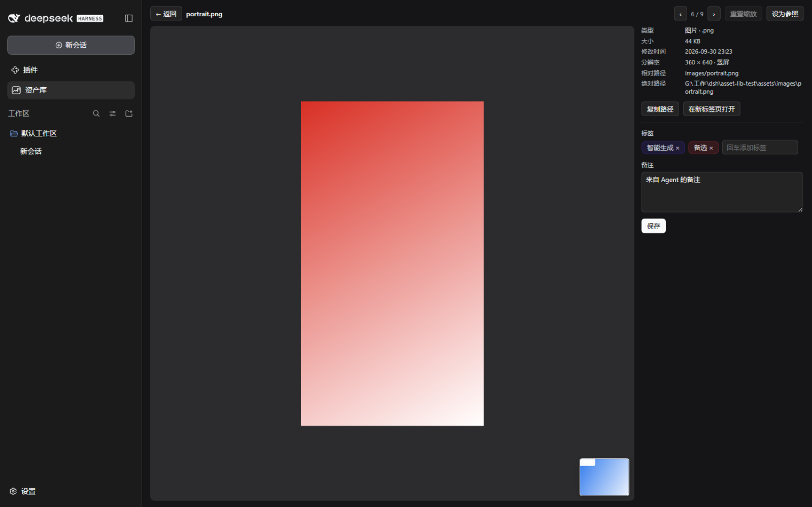
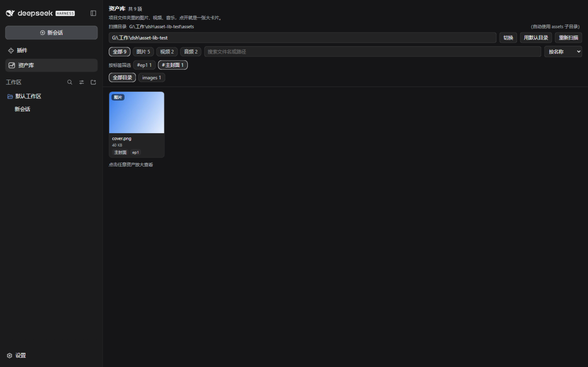

<div align="center">

# 📚 dsh-asset-library

**DeepSeek Harness 的本地资产库插件**

把项目文件夹里的图片、视频、音频，变成一块可浏览、可筛选、可标注的素材面板 ——
并且让 AI 助手能用同一套语义检索它们、拿到绝对路径去引用。

[](#-开发与测试)
[](#-设计原则)
[](#-已知限制)
[](https://github.com/deepseek-ai)

*素材留在你自己的项目目录里 —— 插件只做索引与展示，不搬文件、不改文件。*



</div>

---

## ✨ 它长什么样

**两种视图，零浮层。**

- **网格** —— 缩略图墙：图片直接显示，视频取首帧并标时长（悬停静音预览），音频显示时长徽标。
  卡片上直接标注文件大小、探测到的分辨率、彩色标签。
- **放大卡片** —— 点任意资产进入：左边媒体本体（图片支持**滚轮缩放**、拖拽平移、双击放大，
  透明素材棋盘格衬底），右边详细信息与标注编辑。`Esc` 返回，`←`/`→` 在当前结果里翻页。

<div align="center">

<p><sub>放大卡片：360×640 竖版封面 · 参照图钉悬在角落方便对比候选图</sub></p>
</div>

**为短剧 / AI 视觉工作流设计的功能**

| | 功能 | 说明 |
|---|---|---|
| 🏷️ | 标签与备注 | 点击即筛，按名字稳定配色；搜索同时覆盖路径、标签、备注 |
| 🗂️ | 合集 | 把"类型 + 目录 + 标签 + 关键词"存成命名组合（如 *EP1 封面*），一键整套恢复 |
| ☑️ | 批量打标 | `Ctrl+点击` 多选、`Shift+点击` 范围选择，一次给整批素材加/去标签 |
| 📌 | 参照图钉 | 把一张图钉住，浏览别的素材时悬在角落 —— 对比 AI 生成的候选版本 |
| 📁 | 目录渐进收窄 | 顶层只列一级目录，进入后给"上一级"和直接子目录，不长出超长路径 |
| ⌨️ | 键盘友好 | `/` 搜索、`←`/`→`/`j`/`k` 移动光标、`Enter` 打开、`Esc` 清除 |
| 🔍 | 尺寸探测 | 纯 JS 读文件头（PNG/JPEG/GIF/WEBP/BMP），竖版图 3:4 完整显示不被裁切 |

<div align="center">

<p><sub>标签筛选：点击 <code>#主封面</code> 即时过滤，标题显示"匹配 1 / 共 9 项"</sub></p>
</div>

## 🤖 Agent 工具

三个**只读**工具注册进 harness 后，模型就能检索素材、读元数据、拿绝对路径去引用 ——
和人看到的是**同一份数据、同一套过滤语义**：

| 工具 | 作用 |
|---|---|
| `asset_library_overview` | 概览：扫描目录、各类数量、子目录分布 |
| `asset_library_list` | 检索：按类型 / 关键词 / 标签 / 子目录过滤，排序方向可控，分页 |
| `asset_library_get` | 单条元数据（含探测到的分辨率）+ **绝对路径**，模型据此引用或读取文件 |

> 默认**没有**写工具："模型不能改你的文件，也不能改标注"是默认界线。
> 配置里显式打开 `allowAgentAnnotate: true` 才会多一个 `asset_library_annotate`
> （只能改标签 / 备注，仍然不能动文件）。

## 🏗️ 工作原理

```
┌──────────────────────────┐          ┌───────────────────────────────┐
│  client 半（浏览器面板）    │  fetch   │  host 半（harness 进程内）      │
│  React · 无构建 · 无依赖   │ ───────▶ │  /api/asset-library/*         │
│  缩略图降采样 · LRU · 懒挂载│ ◀─────── │  扫描 · 标注 · Range 媒体流    │
└──────────────────────────┘          └──────────────┬────────────────┘
                                                     │
                              ┌───────────────────────┼──────────────┐
                              ▼                       ▼              ▼
                        <项目>/assets/          <项目>/.dsh-assets/   Agent 工具
                        素材本体（权威来源）        index.json（仅标注）  (只读)
```

### 设计原则

1. **磁盘是权威**。资产清单是扫描的派生结果 —— 在资源管理器里改名 / 删除，下一次扫描就跟着变，
   不会留下幽灵条目。新增 / 删除文件**不用点重扫**就能看到。
2. **索引只存人的输入**。`index.json` 只有标签、备注、用过的根目录，丢了可以重建，不会被扫描覆盖。
3. **一律不缓存**。素材是会被反复覆盖的工作文件，任何一层缓存都会变成"我明明换了图怎么还是旧的"：
   扫描缓存默认关闭、媒体响应 `no-store`、重扫会换媒体 URL 强制重取。
4. **零外部依赖**。不需要 ffmpeg、不装缩略图服务 —— 媒体一律原生播放器 + HTTP Range 流；
   缩略图在浏览器里 `createImageBitmap` + canvas 降采样到 480px；分辨率靠读文件头。
5. **大目录也能用**。卡片贴近视口（±600px）才挂媒体、滚出即释放；缩略图进 LRU（240 张）滚动
   回来零开销；`content-visibility: auto` 跳过视口外卡片的布局与绘制；首屏之后筛选 / 翻页
   每步只有一个请求。

**支持的格式**（封闭清单，只收录浏览器能原生解码的）：

| 类型 | 扩展名 |
|---|---|
| 图片 | jpg jpeg jpe png webp gif avif bmp svg ico tif tiff |
| 视频 | mp4 m4v mov webm mkv avi ogv |
| 音频 | mp3 wav flac m4a aac ogg oga opus aif aiff wma |

默认跳过点开头的目录（`.git`、`.dsh-assets`）、`node_modules`、回收站与系统目录；
深度上限 8 层、文件数上限 20000（都可配置）。

### 🔒 安全

- **路径包含检查**（词法 + `realpath`）：挡 `../` 与指向外部的软链；
- **媒体与 reveal 端点只服务资产扩展名**：`.env`、私钥这类同目录文件读不走；
- **SVG 等内联内容**带 `Content-Security-Policy: sandbox` 与 `nosniff`；
- **reveal 只 spawn 不经 shell**：路径里的字符不会被解释成命令；
- 每个请求都过浏览器信任栅栏（Host / Origin 检查），不快照、按请求解析。

## 🚀 安装

```powershell
# 1) 装进 profile（官方 CLI 负责 bundle 层）
& 'D:\deepseek\resources\runtime\cli\bin\dsh.cmd' plugin --profile desktop add 'G:\工作\dsh\dsh-asset-library'
```

然后把 `profiles\<profile>\package.json` 里这条依赖的规格从 `link:` 改成 `file:`：

```json
"dsh-asset-library": "file:G:/工作/dsh/dsh-asset-library"
```

再同步一次（`file:` 会装成**实体目录**，解析链才完整）：

```powershell
& 'D:\deepseek\resources\runtime\cli\bin\dsh.cmd' plugin --profile desktop install
```

<details>
<summary><b>为什么 <code>link:</code> 不行，<code>file:</code> 行？</b></summary>

Node 解析裸模块名时会先 `realpath`。插件若是指向工作区的 junction，realpath 落在 profile
之外，`@deepseek-ai/schemastery`、`@deepseek-ai/dsh-tools` 这类**由 dsh 安装本体提供**的包
就解析不到，插件会以 `failed to import` 静默退出。DSH 的解析链是：

```
<profile>/node_modules  →  <DSH_HOME>/profiles/node_modules（安装范围投影）
```

`file:` 规格让 pnpm 把包**复制**进 `<profile>/node_modules`（实测是实体目录，不是链接），
解析链因此完整；`link:` / 直接 `pnpm add <目录>` 都会建 junction，必须再用
`tools/dev-install.ps1` 手工替换成实体目录。

> Windows 上还有个**读**文件的坑：`profiles\<profile>\package.json` 是 UTF-8，而 Windows
> PowerShell 5.1 的 `Get-Content` 在没有 BOM 时按 ANSI 解码，含中文的路径会显示成乱码
> （`工作` → `宸ヤ綔`）。这纯属显示假象 —— 要确认就显式解码：
> `[System.IO.File]::ReadAllText($path, [System.Text.Encoding]::UTF8)`。

</details>

<details>
<summary><b>更新已安装的 profile</b></summary>

```powershell
powershell -File tools\sync-all.ps1        # 一键同步 dev(assetdev) + desktop 两个 profile
```

宿主半（`lib/*.js`）改动需要**重启进程**才加载；面板（`client.js`）刷新窗口即可。
面板对新宿主特性（`capabilities`、`tagFacets`）做了协商降级，旧宿主上只是不显示新按钮，
不会报错。

</details>

## ⚙️ 配置

`cordis.patch.yml` 里按行 id 覆盖（全部字段都有默认值，不配也能跑）：

```yaml
- id: asset-library
  name: dsh-asset-library
  config:
    root: 'G:\项目\短剧A'      # 空串=跟随会话工作目录
    assetsDir: assets          # 约定子目录；不存在时直接扫项目根
    indexDir: .dsh-assets      # 索引目录
    includeHidden: false
    maxDepth: 8
    maxFiles: 20000
    cacheMs: 0                 # 扫描缓存毫秒数；默认 0 = 每次都重新扫描
    pageSize: 60
    allowAgentAnnotate: false  # true 时额外注册 asset_library_annotate（只改标注）
```

**目录约定**：插件优先扫 `<项目>/assets/`（`images/`、`video/`、`audio/` 只是习惯分类，
任意深度的子目录都会扫到）；不存在 `assets/` 时直接把项目根当资产目录。

## 🧪 开发与测试

```powershell
# 一次性：建一个开发 profile（独立 DSH_HOME，绝不动桌面应用的 profile）
$env:DSH_HOME="$env:USERPROFILE\.dsh-dev"
& $dsh assetdev --from-default-profile web --help

# 迭代循环：改代码 → 一键同步所有 profile → 重启对应实例
powershell -File tools\sync-all.ps1
& $dsh --profile assetdev --port 3084 --no-open
```

三层测试，**全部离线可跑**（当前 220 项全绿）：

| 命令 | 覆盖 | 项数 |
|---|---|---|
| `node tools\client-test.mjs` | 面板契约 + 交互行为（自带迷你 React 渲染器，真的走点击 / 翻页 / 批量 / 键盘链路） | 111 |
| `node tools\tool-test.mjs <项目>` | Agent 工具行为（须从 profile 内副本运行） | 38 |
| `tools\asset-library-smoke.ps1` | HTTP 面 + Range + 安全收口 + 不缓存（用 curl.exe，理由见脚本头注释） | 71 |

测试脚本必须用 **ASCII 编写**（中文从参数传入）—— Windows PowerShell 5.1 会把无 BOM 的
UTF-8 脚本按 ANSI 读。`tools\make-asset-fixture.ps1` 可生成带中文目录 / 隐藏文件 / 各类型
媒体的测试夹具。

## 📋 已知限制

- **缩略图是浏览器端降采样**：首次进视口要下载原图再压缩，超大图有一次"原图传输"；
  要更省带宽就得在宿主侧生成并缓存缩略图（那是引入 ffmpeg/sharp 的取舍）。
- **视频首帧封面**取决于浏览器能否解析容器元数据；mkv/avi 可能显示为空白卡片。
- **AVIF/TIFF/SVG 不做头部尺寸探测**（盒子结构复杂或本身是矢量），详情页由浏览器实测兜底。
- **没有转码 / 代理文件**：4K 素材直接原码率播放。
- **扫描不进 worker 线程**（有意决策）：`fs.promises` 本就走 libuv 线程池，不会阻塞事件循环；
  尺寸探测已按 `(mtime, size)` 增量化。真到十万文件量级再考虑。
- **宿主半改动需要重启进程**（HMR 只保证新 bundle 挂载）；面板已做能力协商降级。

---

<div align="center">
<sub>为 DeepSeek Harness 生态而写 · 三条原则：磁盘是权威 · 索引只存人的输入 · 一律不缓存</sub>
</div>
