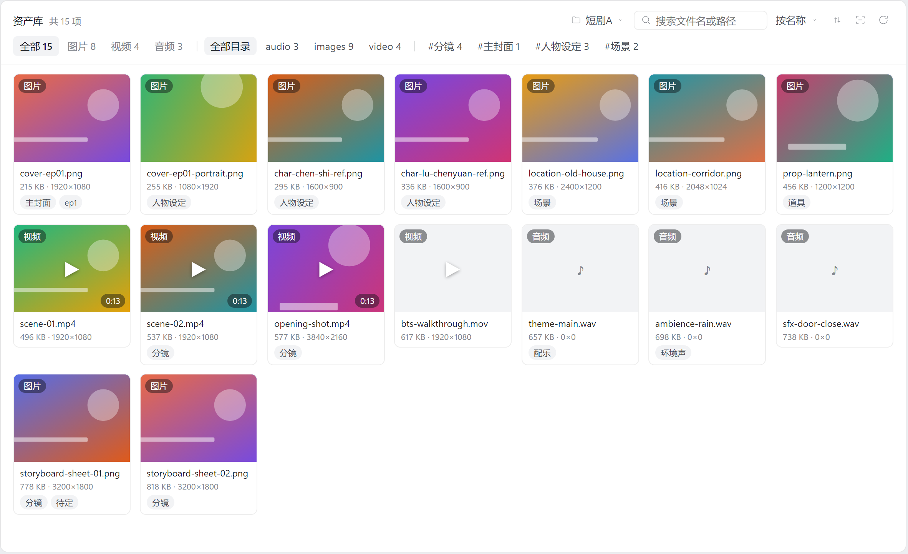
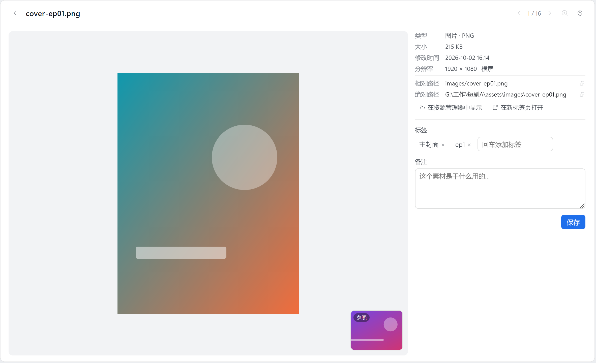
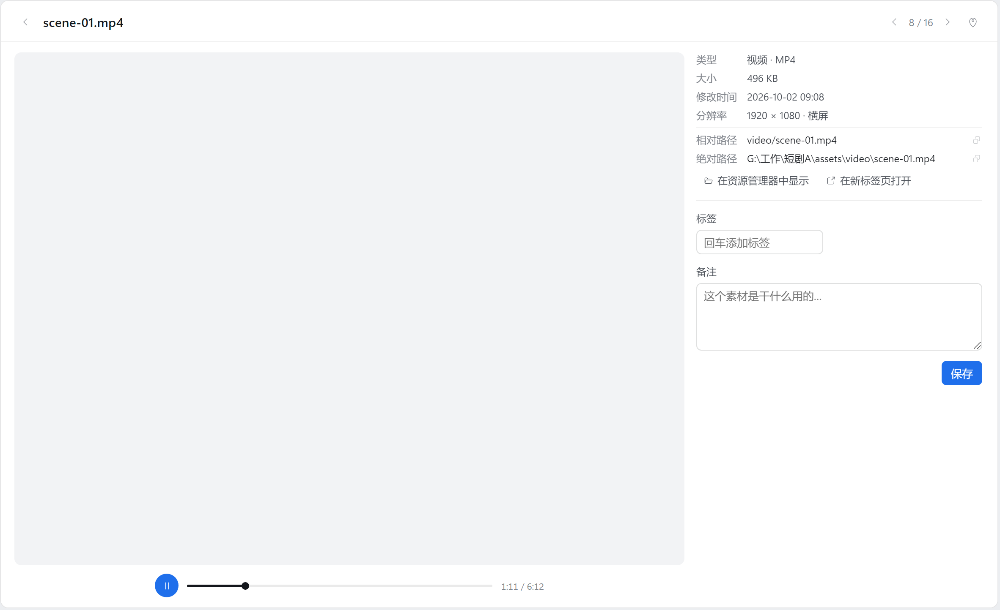
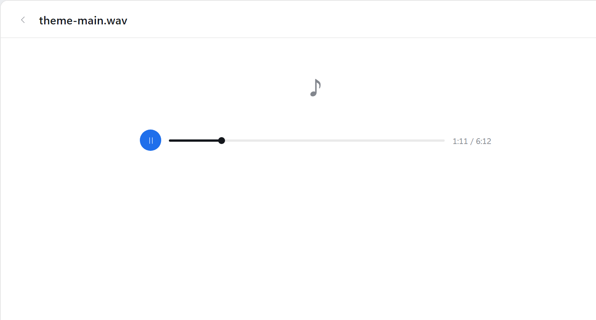
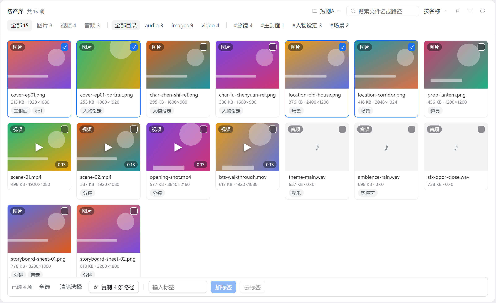
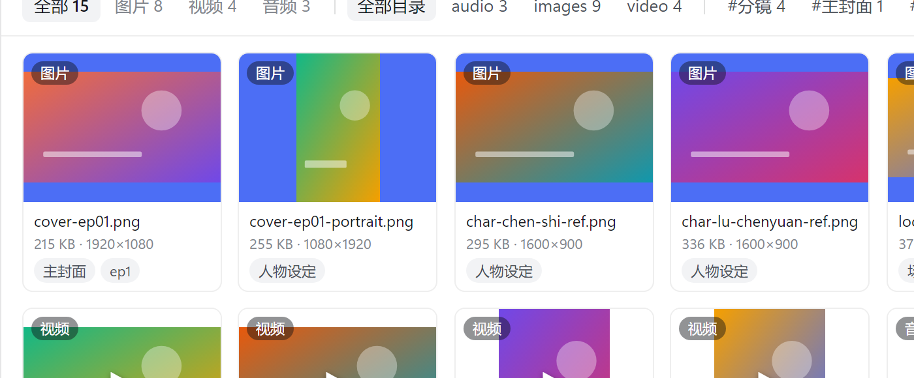
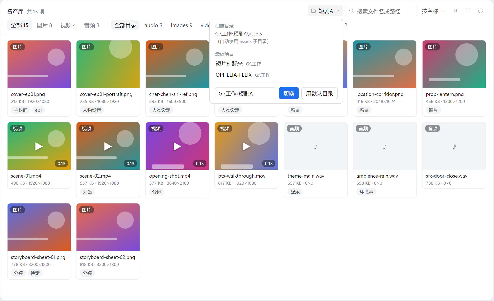

<div align="center">

# 📚 dsh-asset-library

**DeepSeek Harness 的本地资产库插件**

把项目文件夹里的图片、视频、音频，变成一块可浏览、可筛选、可标注的素材面板 ——
并且让 AI 助手能用同一套语义检索它们、拿到绝对路径去引用。

[](#-开发与测试)
[](#-设计原则)
[](LICENSE)
[](#-安装)
[](#-已知限制)
[](https://github.com/deepseek-ai)

*素材留在你自己的项目目录里 —— 插件只做索引与展示，不搬文件、不改文件。*



[**它长什么样**](#-它长什么样) ·
[**Agent 工具**](#-agent-工具) ·
[**工作原理**](#️-工作原理) ·
[**安装**](#-安装) ·
[**配置**](#️-配置) ·
[**开发与测试**](#-开发与测试) ·
[**已知限制**](#-已知限制)

</div>

---

## 🤔 为什么需要它

做短剧 / AI 视觉的工作流里，素材就堆在项目目录下：`EP1/封面/` 有二十个候选版本，
`角色/` 里同一个人的定妆照改了七遍。资源管理器能给缩略图，但给不了**标签、备注、
候选对比、批量打标**，更没法让 Agent 用同一套语义把它们找出来。

`dsh-asset-library` 补的就是这一层：**不建素材库、不搬文件、不导入**，
只在原地把目录扫出来、显示出来、标起来 —— 顺便把这份语义开放给 Agent。

| | 传统素材管理器 | dsh-asset-library |
|---|---|---|
| 素材位置 | 导入进它的库里 | **原地不动**，就在你项目目录 |
| 删除文件后 | 库里留幽灵条目 | 下次扫描自动同步 |
| 标注存哪 | 它自己的私有数据库 | `.dsh-assets/index.json`，可读可重建 |
| Agent 能否看见 | 通常不能 | **能**，且与人看到同一份数据 |
| 依赖 | 常有缩略图服务 / ffmpeg | **0 依赖**，纯 JS 读文件头 + 浏览器降采样 |

## ✨ 它长什么样

**两种视图，零浮层。** 表头压成两行：第一行是"当前在哪 + 搜索 + 排序 + 重扫"，
第二行是"当前筛了什么"，所有维度共用同一种 chip，靠发丝线分组。

- **网格** —— 缩略图墙：图片直接显示，视频取首帧并标时长（悬停静音预览），音频显示时长徽标。
  卡片上直接标注文件大小、探测到的分辨率、标签。工具栏的 **⊞ 按钮**在「填满裁切」与
  「完整构图」之间切换 —— 竖图在默认的 cover 下会被裁掉上下三分之一。
- **放大卡片** —— 点任意资产进入：左边媒体本体（图片支持**滚轮缩放**、拖拽平移、双击放大，
  透明素材棋盘格衬底），右边详细信息与标注编辑。视频/音频用**自绘播放条**（播放/暂停、进度、
  时间；点画面或按空格也能播停），`Esc` 返回，`←`/`→` 在当前结果里翻页。

<div align="center">

<p><sub>放大卡片：表头与网格表头同一套排版 · 右列分「规格 / 位置 / 标注」三块 · 路径行点一下即复制 · 右下角图钉是参照图</sub></p>
</div>

<div align="center">

<p><sub>视频播放条：自绘而非原生 <code>controls</code> —— 播放/暂停、3px 进度条（可点可拖）、时间；点画面或按空格播停</sub></p>
</div>

<div align="center">

<p><sub>音频用同一条播放条；♪ 不再套那块空灰底舞台</sub></p>
</div>

**为短剧 / AI 视觉工作流设计的功能**

| | 功能 | 说明 |
|---|---|---|
| 🏷️ | 标签与备注 | 点击即筛；标签样式走主题 token（深色主题自动跟随，不自算颜色）；搜索同时覆盖路径、标签、备注 |
| 🗂️ | 合集 | 把"类型 + 目录 + 标签 + 关键词"存成命名组合（如 *EP1 封面*），一键整套恢复 |
| ☑️ | 批量打标 | 点卡片右上角的**勾选框**、`Ctrl+点击` 多选、`Shift+点击` 范围选择、`X` 选中光标项 —— 四个入口共用一条实现 |
| 📋 | **批量复制路径** | 选中 N 个 → 一次把 N 条**相对路径**按网格顺序写进剪贴板，一行一个，直接粘进剪辑软件或脚本 |
| 🖼️ | 缩略图填充切换 | 工具栏 ⊞ 在 `cover`（填满，网格整齐）与 `contain`（完整构图，竖图不被裁）之间切；选择进本地偏好 |
| 🧹 | 空状态可自救 | 搜不到时说的是"没有符合筛选条件的素材"并给一个**清除筛选**按钮，而不是把人引去"请往目录里放文件" |
| 📌 | 参照图钉 | 把一张图钉住，浏览别的素材时悬在角落 —— 对比 AI 生成的候选版本 |
| 📁 | 目录渐进收窄 | 顶层只列一级目录，进入后给"上一级"和直接子目录，不长出超长路径 |
| ⌨️ | 键盘友好 | `/` 搜索、`←`/`→`/`j`/`k` 移动光标、`Enter` 打开、`X` 选中、`空格` 播停、`Esc` 清除 |
| 🔍 | 尺寸探测 | 纯 JS 读文件头（PNG/JPEG/GIF/WEBP/BMP）；缩略图统一 4:3 画框，横竖版混排也不跳版 |

<div align="center">

<p><sub>标签筛选：点 <code>#分镜</code> 即时过滤，标题实时显示"匹配 N / 共 M 项"</sub></p>
</div>

<div align="center">

<p><sub>批量操作条：<code>复制 N 条路径</code>（点一下就走，不用填任何东西）与打标签输入框之间用一条发丝线分开</sub></p>
</div>

<div align="center">

<p><sub><code>contain</code> 模式：第二张竖图（1080×1920）露出完整构图，格子尺寸不变、网格照样整齐</sub></p>
</div>

<div align="center">

<p><sub>项目切换器：当前扫描目录 / 最近项目 / 手动输入路径 —— 换项目不必重启</sub></p>
</div>

## 🤖 Agent 工具

三个**只读**工具注册进 harness 后，模型就能检索素材、读元数据、拿绝对路径去引用 ——
和人看到的是**同一份数据、同一套过滤语义**：

| 工具 | 作用 |
|---|---|
| `asset_library_overview` | 概览：扫描目录、各类数量、子目录分布 |
| `asset_library_list` | 检索：按类型 / 关键词 / 标签 / 子目录过滤，排序方向可控，分页 |
| `asset_library_get` | 单条元数据（含探测到的分辨率）+ **绝对路径**，模型据此引用或读取文件 |

> 默认**没有**写工具："模型不能改你的文件，也不能改标注"是默认界线。
> 配置里显式打开 `allowAgentAnnotate: true` 才会多一个 `asset_library_annotate`
> （只能改标签 / 备注，仍然不能动文件）。

## 🏗️ 工作原理

```
┌──────────────────────────┐          ┌───────────────────────────────┐
│  client 半（浏览器面板）    │  fetch   │  host 半（harness 进程内）      │
│  React · 无构建 · 无依赖   │ ───────▶ │  /api/asset-library/*         │
│  缩略图降采样 · LRU · 懒挂载│ ◀─────── │  扫描 · 标注 · Range 媒体流    │
└──────────────────────────┘          └──────────────┬────────────────┘
                                                     │
                              ┌───────────────────────┼──────────────┐
                              ▼                       ▼              ▼
                        <项目>/assets/          <项目>/.dsh-assets/   Agent 工具
                        素材本体（权威来源）        index.json（仅标注）  (只读)
```

### 设计原则

1. **磁盘是权威**。资产清单是扫描的派生结果 —— 在资源管理器里改名 / 删除，下一次扫描就跟着变，
   不会留下幽灵条目。新增 / 删除文件**不用点重扫**就能看到。
2. **索引只存人的输入**。`index.json` 只有标签、备注、用过的根目录，丢了可以重建，不会被扫描覆盖。
3. **一律不缓存**。素材是会被反复覆盖的工作文件，任何一层缓存都会变成"我明明换了图怎么还是旧的"：
   扫描缓存默认关闭、媒体响应 `no-store`、重扫会换媒体 URL 强制重取。
   唯一的例外是**尺寸备忘录**：它按 `(relPath, mtime, size)` 收敛，文件一动就失效，
   只用来省掉"重新打开每张图读文件头"这一步 —— 内容永远是当下磁盘上的内容。
4. **零外部依赖**。不需要 ffmpeg、不装缩略图服务 —— 媒体一律原生播放器 + HTTP Range 流；
   缩略图在浏览器里 `createImageBitmap` + canvas 降采样到 480px；分辨率靠读文件头。
5. **大目录也能用**。卡片贴近视口（±600px）才挂媒体、滚出即释放；缩略图进 LRU（240 张）滚动
   回来零开销；`content-visibility: auto` 跳过视口外卡片的布局与绘制；首屏之后筛选 / 翻页
   每步只有一个请求。
6. **热路径不跑扫描**。`/file`、`/reveal` 每个请求只需要"根在哪"，就只解析根（一次 `stat`，
   带记忆），不遍历目录树 —— 否则一张网格 60 张封面就是 60 次全量扫描，宿主与文件流抢同一个
   线程池，表现就是"切换类型 / 滚动很卡"。面板侧给缩略图与视频取帧各设了并发闸门（4 / 2），
   首屏几十张卡片是逐步浮现，而不是把主线程一次性冻住。

### 状态存在哪

| 状态 | 位置 | 丢了会怎样 |
|---|---|---|
| 标签 / 备注 | `<项目>/.dsh-assets/index.json` | 人的输入，丢了就没了（可随项目一起提交） |
| 上次的项目根 | `<DSH_HOME>/asset-library.json` | 重启后回到默认目录，需要重新选一次 |
| 尺寸备忘录 | `<DSH_HOME>/asset-library-scan-cache.json` | 下次扫描把每张图的文件头重读一遍（只是慢） |
| 缩略图 / 封面 / 时长 | 浏览器 Cache Storage + localStorage | 重新向宿主取一遍（只是慢） |

前两项之外，全部可以从磁盘重算 —— 这是"磁盘是权威"的具体含义。

**支持的格式**（封闭清单，只收录浏览器能原生解码的）：

| 类型 | 扩展名 |
|---|---|
| 图片 | jpg jpeg jpe png webp gif avif bmp svg ico tif tiff |
| 视频 | mp4 m4v mov webm mkv avi ogv |
| 音频 | mp3 wav flac m4a aac ogg oga opus aif aiff wma |

默认跳过点开头的目录（`.git`、`.dsh-assets`）、`node_modules`、回收站与系统目录；
深度上限 8 层、文件数上限 20000（都可配置）。

### 🔒 安全

- **路径包含检查**（词法 + `realpath`）：挡 `../` 与指向外部的软链；
- **媒体与 reveal 端点只服务资产扩展名**：`.env`、私钥这类同目录文件读不走；
- **SVG 等内联内容**带 `Content-Security-Policy: sandbox` 与 `nosniff`；
- **reveal 只 spawn 不经 shell**：路径里的字符不会被解释成命令；
- 每个请求都过浏览器信任栅栏（Host / Origin 检查），不快照、按请求解析。

## 🚀 安装

> **前置**：Node.js ≥ 22、已安装 DeepSeek Harness。本仓库是**插件源码**，
> 不是独立应用 —— 它需要一个 DSH 宿主才能跑起来。

```powershell
# 1) 装进 profile（官方 CLI 负责 bundle 层）
& 'D:\deepseek\resources\runtime\cli\bin\dsh.cmd' plugin --profile desktop add 'G:\工作\dsh\dsh-asset-library'
```

然后把 `profiles\<profile>\package.json` 里这条依赖的规格从 `link:` 改成 `file:`：

```json
"dsh-asset-library": "file:G:/工作/dsh/dsh-asset-library"
```

再同步一次（`file:` 会装成**实体目录**，解析链才完整）：

```powershell
& 'D:\deepseek\resources\runtime\cli\bin\dsh.cmd' plugin --profile desktop install
```

<details>
<summary><b>为什么 <code>link:</code> 不行，<code>file:</code> 行？</b></summary>

Node 解析裸模块名时会先 `realpath`。插件若是指向工作区的 junction，realpath 落在 profile
之外，`@deepseek-ai/schemastery`、`@deepseek-ai/dsh-tools` 这类**由 dsh 安装本体提供**的包
就解析不到，插件会以 `failed to import` 静默退出。DSH 的解析链是：

```
<profile>/node_modules  →  <DSH_HOME>/profiles/node_modules（安装范围投影）
```

`file:` 规格让 pnpm 把包**复制**进 `<profile>/node_modules`（实测是实体目录，不是链接），
解析链因此完整；`link:` / 直接 `pnpm add <目录>` 都会建 junction，必须再用
`tools/dev-install.ps1` 手工替换成实体目录。

> Windows 上还有个**读**文件的坑：`profiles\<profile>\package.json` 是 UTF-8，而 Windows
> PowerShell 5.1 的 `Get-Content` 在没有 BOM 时按 ANSI 解码，含中文的路径会显示成乱码
> （`工作` → `宸ヤ綔`）。这纯属显示假象 —— 要确认就显式解码：
> `[System.IO.File]::ReadAllText($path, [System.Text.Encoding]::UTF8)`。

</details>

<details>
<summary><b>更新已安装的 profile</b></summary>

```powershell
powershell -File tools\sync-all.ps1        # 一键同步 dev(assetdev) + desktop 两个 profile
```

宿主半（`lib/*.js`）改动需要**重启进程**才加载；面板（`client.js`）刷新窗口即可。
面板对新宿主特性（`capabilities`、`tagFacets`）做了协商降级，旧宿主上只是不显示新按钮，
不会报错。

</details>

## ⚙️ 配置

`cordis.patch.yml` 里按行 id 覆盖（全部字段都有默认值，不配也能跑）：

```yaml
- id: asset-library
  name: dsh-asset-library
  config:
    root: 'G:\项目\短剧A'      # 空串=跟随会话工作目录
    assetsDir: assets          # 约定子目录；不存在时直接扫项目根
    indexDir: .dsh-assets      # 索引目录
    includeHidden: false
    maxDepth: 8
    maxFiles: 20000
    cacheMs: 0                 # 扫描缓存毫秒数；默认 0 = 每次都重新扫描
    pageSize: 60
    allowAgentAnnotate: false  # true 时额外注册 asset_library_annotate（只改标注）
```

**目录约定**：插件优先扫 `<项目>/assets/`（`images/`、`video/`、`audio/` 只是习惯分类，
任意深度的子目录都会扫到）；不存在 `assets/` 时直接把项目根当资产目录。

**记住项目**：在面板里切换过项目之后，这个选择会写进 `<DSH_HOME>/asset-library.json`，
**下次启动直接用上次那个目录**，不用再选一次。路径必须仍然存在且是目录，否则安静退回
默认解析链；点"用默认目录"会同时清掉这份记忆。解析优先级：
单次调用的显式 root → 本次进程内选过的 → 上次选过的 → 配置里的 `root` → 会话工作目录 → 进程 cwd。

## 📂 项目结构

```
dsh-asset-library/
├── index.js              # host 半入口：注册 web 路由 + Agent 工具
├── client.js             # 面板（浏览器半）：网格 / 放大卡片 / 键盘 / 批量 / 合集
├── cordis.patch.yml      # 只 insert 自己那行 loader，不替换官方组件
├── package.json          # dsh.bundle / dsh.client 声明
├── icon.svg
├── locale/{zh,en}.json   # 面板标题与描述
├── lib/                  # host 半实现（10 个模块，职责单一）
│   ├── service.js        #   内核：根目录解析（含记住上次项目）、扫描编排、尺寸备忘录、查询、标注
│   ├── routes.js         #   HTTP 端点、Range 媒体流、安全收口
│   ├── scan.js           #   递归扫描、跳过规则、目录 facet
│   ├── store.js          #   index.json 读 / 原子写 / 标注合并
│   ├── dimensions.js     #   读文件头探分辨率（PNG/JPEG/GIF/WEBP/BMP）
│   ├── kinds.js          #   扩展名 → 类型 / MIME 封闭清单
│   ├── paths.js          #   路径归一化、包含检查、软链防御
│   ├── config.js         #   schemastery 配置模式与默认值
│   ├── tools.js          #   Agent 工具定义
│   └── home.js           #   DSH_HOME 解析与原子 JSON 读写
├── tools/                # 开发与测试脚本
│   ├── client-test.mjs   #   面板契约 + 交互行为（迷你 React 渲染器）
│   ├── tool-test.mjs     #   Agent 工具行为
│   ├── render-preview.mjs#   把面板离屏渲染成静态 HTML，用于改视觉时看真实观感
│   ├── sync-dev.mjs      #   把源码覆盖到已安装 profile 并逐字节校验
│   └── *.ps1             #   profile 安装 / 夹具 / 端到端冒烟
├── docs/preview/         # 由 render-preview 生成的离屏预览（grid / menu / detail / player / audio / fit / filter / batch）
└── docs/screenshots/     # README 用图，同样由离屏预览 + 无头截图产出（非手截）
```

## 🧪 开发与测试

```powershell
# 一次性：建一个开发 profile（独立 DSH_HOME，绝不动桌面应用的 profile）
$env:DSH_HOME="$env:USERPROFILE\.dsh-dev"
& $dsh assetdev --from-default-profile web --help

# 迭代循环：改代码 → 一键同步所有 profile → 重启对应实例
powershell -File tools\sync-all.ps1
& $dsh --profile assetdev --port 3084 --no-open
```

三层测试，**全部离线可跑**（当前 265 项全绿）：

| 命令 | 覆盖 | 项数 |
|---|---|---|
| `node tools\client-test.mjs` | 面板契约 + 交互行为（自带迷你 React 渲染器，真的走点击 / 翻页 / 批量 / 键盘链路） | 156 |
| `node tools\tool-test.mjs <项目>` | Agent 工具行为（须从 profile 内副本运行） | 38 |
| `tools\asset-library-smoke.ps1` | HTTP 面 + Range + 安全收口 + 不缓存（用 curl.exe，理由见脚本头注释） | 71 |

测试脚本必须用 **ASCII 编写**（中文从参数传入）—— Windows PowerShell 5.1 会把无 BOM 的
UTF-8 脚本按 ANSI 读。`tools\make-asset-fixture.ps1` 可生成带中文目录 / 隐藏文件 / 各类型
媒体的测试夹具。

### 改面板视觉时怎么验证

断言只能证明"结构还在"，证明不了"看着是否干净"。所以改 `client.js` 的 CSS / JSX 之后，
按这条链路看一眼真实渲染：

```bash
# 1) 离屏渲染：把 <Panel> 用假数据渲染成静态 HTML（grid / menu / detail / filter / batch 五个状态）
node tools/render-preview.mjs
#    也能渲染任意一版 client.js，用来出前后对比：
mkdir -p .workbuddy/verify/before
git show HEAD:client.js > .workbuddy/verify/before/client.js
node tools/render-preview.mjs --client .workbuddy/verify/before/client.js --out-dir .workbuddy/verify/before

# 2) 无头截图（精确视口 + 把 DOM 测量打回终端）
node .workbuddy/verify/shot.mjs --url "file:///.../docs/preview/grid.html" \
  --out _grid.png --w 1228 --h 768 --dpr 2 --clip "24,24,1182,722" \
  --eval "(function(){const b=document.querySelector('.dal-head').getBoundingClientRect();return 'headH='+Math.round(b.height);})()"
```

改版的完整前后对照（表头特写 + 整屏并排 + 指标表）见
`docs/screenshots/redesign-before-after.png`。

三个容易误判的地方：

- **别用 `--screenshot=` 命令行截图**：`--window-size` 是窗口尺寸（含浏览器 chrome），
  底部会多出一条 html 底色，看起来像"背景穿帮"，其实是工具的假象。CDP 用
  `Emulation.setDeviceMetricsOverride` 精确设定视口。
- **`--clip` 不能再用 dpr 换算**：`deviceScaleFactor` 已经让整页按 DPR 渲染，`clip.scale`
  再乘一次 DPR 会得到 dpr² 倍图，采样坐标就全错一倍。
- **改完源码记得 `node tools/sync-dev.mjs`**：`file:` 规格装的是实体副本，不同步就是
  "改了没反应"。脚本会逐字节回读校验，只有全部一致才算成功。

往预览里预置状态时，槽位下标一律用 `panelHookIndex(变量名)` 从 `client.js` 源码解析，
不要写死数字 —— 数字错位是**静默**的，只会表现成"少渲染了某个部件"。
另有两个坑：`items` 加载前写进去的状态会被"选择集合随列表收敛"那条 effect 清掉，
要等数据落定（`latePanel`）；改 `Panel` 的 hook 顺序后槽位会整体平移，脚本能自己跟上。

写断言时注意这五件会**假失败**（或假通过）的事（都已在 `tools/client-test.mjs` 里处理）：

- `view.flat` 是"可见文字"，样式表内容不算（否则 CSS 注释里出现某个词就会撞上文案断言）。
- `view.classes` 存的是**类名 token**（否则 `class="dal-grid dal-selecting"` 会让
  `classes.has('dal-grid')` 静默失效）。定位带修饰的元素用 `withClass`；`byClass` 只在
  className 恰好等于该字符串时命中 —— **数卡片数必须用 `withClass`**，选中的卡片
  className 变成 `dal-card dal-selected`，用 `byClass` 会把它们全漏掉。
- 纯图标按钮（里面只有一个 svg、没有任何可见文字）**只能用 `title` 或 `aria-label` 定位**，
  `labelOf` 必然返回空串。带图标的文字按钮用 `byLabelIn`（`byText` 只在 children 全等时命中，
  而带图标的按钮 children 是 `[svg, 文字]`）。
- 假服务 `/assets` 现在**真的**按 `q`/`kind`/`tag`/`dir` 过滤。曾经不真过滤，于是"搜索无结果"
  这条路径永远走不到，而且有断言把"永远返回 3 条"写成了预期值 —— 桩的假象变成了规格。
- 搜索防抖是**真实 setTimeout(220ms)**，`settle()` 只排空微任务。跨防抖的用例必须
  `await wait(280)`，而且顺序是「改输入 → `frame()`（effect 才挂上定时器）→ 等 → `frame()`」。

渲染器本身还有两个必须知道的约定：

- `useState` 的槽位存的是 `{ value }`。预置状态（`render-preview.mjs` 的 `preset()`）必须
  写 `{ value: x }`；直接写裸值会被读成 `undefined`，预置**静默失效且不报错**。
- `collect()` 会给带 `ref` 的元素挂一个假 DOM 节点（有 `getBoundingClientRect`、
  `addEventListener`、`dataset`）。尺寸写成非零是有意的：代码里常有
  `if (box.width === 0) return` 这类守卫，0 尺寸会让断言看起来像"功能没实现"。

改 CSS 前先确认 token 的**真实取值**，别照着变量名猜语义。已经从 `app.asar` 里查清、
写面板时会踩的两条：

- `--dsw-alias-label-primary-inverted` **会跟主题反转**：浅色主题是 #fff，
  深色主题是 `--dsw-static-neutral-bluish-800`(#292929，深色)。它只在"和遮罩填色成对
  反转"时才安全（DSH 自己的照片遮罩按钮就是这么配的）。**永久压在照片上**的元素
  （徽标、勾选框、参照角标）用它会在深色主题下变成深底深字而隐形 —— 改用
  `--dsw-static-neutral-bluish-00`（固定 #fff，与 `label-primary-foreground` 同源）。
- `client.js` 的 CSS 是**模板字符串，注释里不能出现反引号**。在 CSS 注释里写
  `` `--dsw-alias-xxx` `` 会让模板当场提前收尾，`node --check` 报
  `Invalid left-hand side expression in postfix operation`。注释里引用 token 只能裸写名字。

## 📋 已知限制

- **缩略图是浏览器端降采样**：首次进视口要下载原图再压缩，超大图有一次"原图传输"；
  要更省带宽就得在宿主侧生成并缓存缩略图（那是引入 ffmpeg/sharp 的取舍）。
  首屏因此设了并发闸门（缩略图 4、视频取帧 2）：牺牲一点"同时出图"的观感，换界面不冻住。
- **视频首帧封面**取决于浏览器能否解析容器元数据；mkv/avi 可能显示为空白卡片
  （等元数据有 8 秒上限，超时就当没有封面，不再让那张卡片一直转圈）。
- **AVIF/TIFF/SVG 不做头部尺寸探测**（盒子结构复杂或本身是矢量），详情页由浏览器实测兜底。
- **没有转码 / 代理文件**：4K 素材直接原码率播放。
- **扫描不进 worker 线程**（有意决策）：`fs.promises` 本就走 libuv 线程池，不会阻塞事件循环；
  尺寸探测已按 `(mtime, size)` 增量化并落盘。真到十万文件量级再考虑。
- **宿主半改动需要重启进程**（HMR 只保证新 bundle 挂载）；面板已做能力协商降级。

---

<div align="center">

**为 DeepSeek Harness 生态而写**

*三条原则：磁盘是权威 · 索引只存人的输入 · 一律不缓存*

[MIT License](LICENSE) · [更新日志](CHANGELOG.md) · [提交问题](https://github.com/Hnqhj/dsh-asset-library/issues)

</div>
